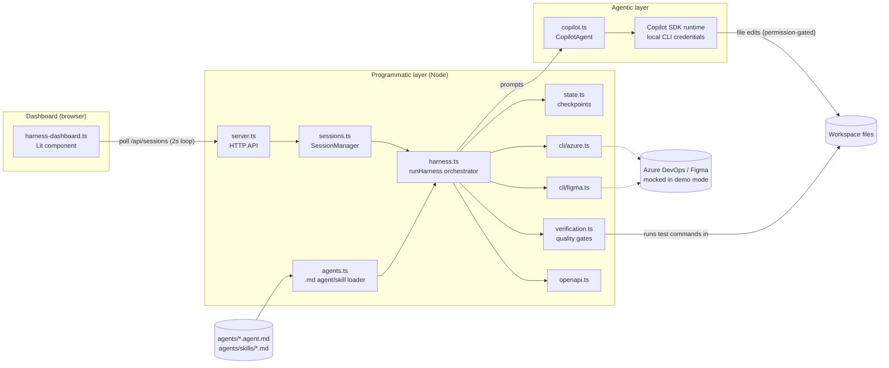
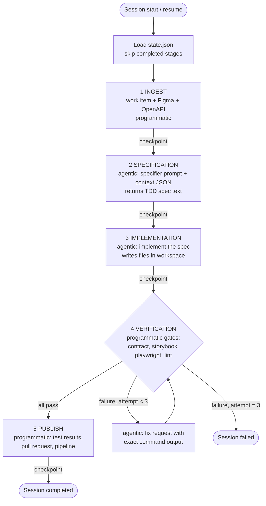
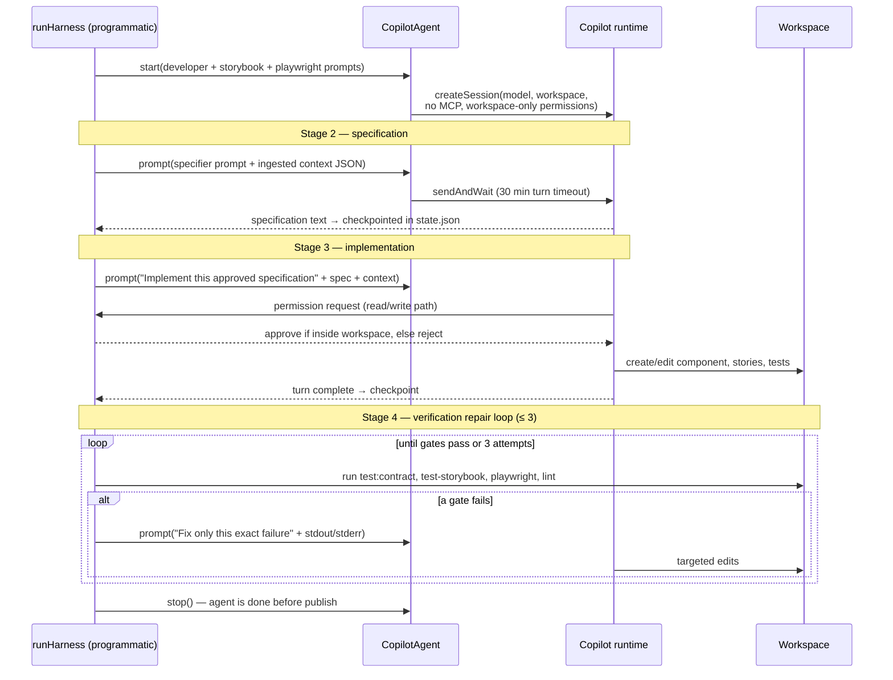
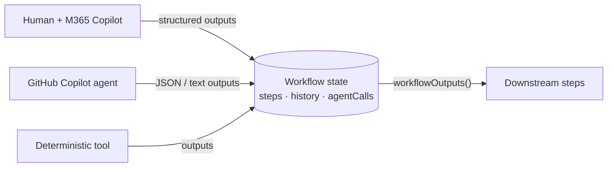

# Harness architecture

The harness is split into two layers with a deliberately narrow boundary:

- **Programmatic layer** (deterministic): [src/harness.ts](../src/harness.ts),
  [src/state.ts](../src/state.ts), [src/verification.ts](../src/verification.ts),
  [src/cli/azure.ts](../src/cli/azure.ts), [src/cli/figma.ts](../src/cli/figma.ts),
  [src/openapi.ts](../src/openapi.ts), the dashboard server and session manager.
  It owns sequencing, state, retries, I/O with external systems, and publishing.
- **Agentic layer** (non-deterministic): a single Copilot session wrapped by
  `CopilotAgent` in [src/copilot.ts](../src/copilot.ts). It owns only the
  *content* of the work: writing the specification and editing files in the
  workspace. It never advances the workflow, never publishes, and can only
  touch files inside the workspace.

The orchestrator treats the agent as a function: *context in → text/file edits
out*. All control flow stays in the programmatic layer.

## Component map

## The five-stage workflow and its loops

`runHarness` executes five stages. Every stage ends with an atomic checkpoint
to `state.json`, which makes interrupted runs resumable: on restart, completed
stages are skipped (the **resume loop**).

Stages 1, 4, and 5 are purely programmatic. Stages 2 and 3 delegate to the
agent. The only loop that crosses the layer boundary is the **verification
repair loop** (max 3 attempts).

## Programmatic ↔ agentic interaction

One Copilot session spans stages 2–4, so the agent keeps conversational
context (its own spec, its own edits, previous failures). The orchestrator is
the only side that speaks first; the agent can only respond or ask for file
permissions.

### What crosses the boundary

| Direction | Payload |
| --- | --- |
| programmatic → agentic | System prompts (role, Storybook/Playwright requirements), ingested context as JSON, the approved spec, verbatim verification failures |
| agentic → programmatic | Specification text (stored in state), file edits in the workspace, permission requests |

The prompts themselves are authored as Markdown agent and skill definitions in
[agents/](../agents/), loaded by [src/agents.ts](../src/agents.ts) with
built-in fallbacks — see [authoring-agents.md](authoring-agents.md).

The agent never receives credentials, Azure/Figma clients, or publish
capabilities. The permission handler in [src/copilot.ts](../src/copilot.ts)
rejects anything that is not a read/write inside the workspace (no MCP, no
shell, no URLs, no sandbox bypass).

## Other loops in the system

- **Verification repair loop** — the only cross-layer loop; bounded at 3
  attempts, each attempt checkpointed (`state.attempts`).
- **Resume loop** — every checkpoint is written atomically; re-running a
  session replays only unfinished stages.
- **Workspace serialization loop** — `SessionManager` chains sessions that
  share a workspace so only one harness run mutates it at a time; different
  workspaces run concurrently.
- **Dashboard polling loop** — the UI refreshes `/api/sessions` every 2 s to
  render stage progress, attempts, and errors.

## Demo mode and the service seam

External integrations are injected through `HarnessServices`
([src/types.ts](../src/types.ts)): `azure`, `figma`, `loadOpenApi`, and
`verificationRunner`. Production resolves them to real clients; demo mode
([src/demo.ts](../src/demo.ts)) and tests substitute mocks. The agentic layer
has no seam on purpose — the demo exercises the real Copilot session with the
local CLI credentials, so the programmatic/agentic interaction above is
identical in demo and production.

## Hybrid attended execution

Steps are declared in [src/workflow.ts](../src/workflow.ts) with a default
executor and the executors they accept. The harness runs every assignable step
through one path: mark started → execute → validate outputs against the step's
output contract → checkpoint. Only the *execute* part differs:

A human step moves the step to `waiting_for_human` and persists it. With an
attended channel (the dashboard's `awaitHumanInput`) the run blocks until
outputs are submitted; without one (CLI) `runHarness` returns
`{ status: 'waiting_for_human' }` and `--submit` resumes it. Step status and
workflow progression are independent of the executor type.

## Extension points for harness developers

The harness is improved along two independent seams:

1. **Behavior of the agentic layer** — Markdown agent/skill definitions in
   [agents/](../agents/). Edit `developer.agent.md`, `specifier.agent.md`, or
   the skill files they compose; point `HARNESS_AGENTS_DIR` at an alternative
   directory to experiment. Format, composition rules, stage mapping, and the
   path to agentifying programmatic stages (e.g. an ingest agent with az CLI
   and Figma API skills) are specified in
   [authoring-agents.md](authoring-agents.md).
2. **Integrations of the programmatic layer** — the `HarnessServices`
   interfaces above, for replacing how the harness reaches Azure DevOps,
   Figma, OpenAPI, or the verification runner.

Control flow (stage order, checkpoints, the three-attempt repair loop, the
permission model) is deliberately not an extension point: it stays in code so
the workflow remains deterministic regardless of prompt content.
